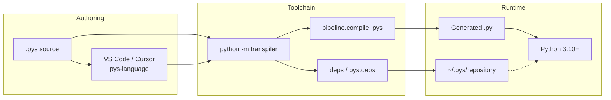
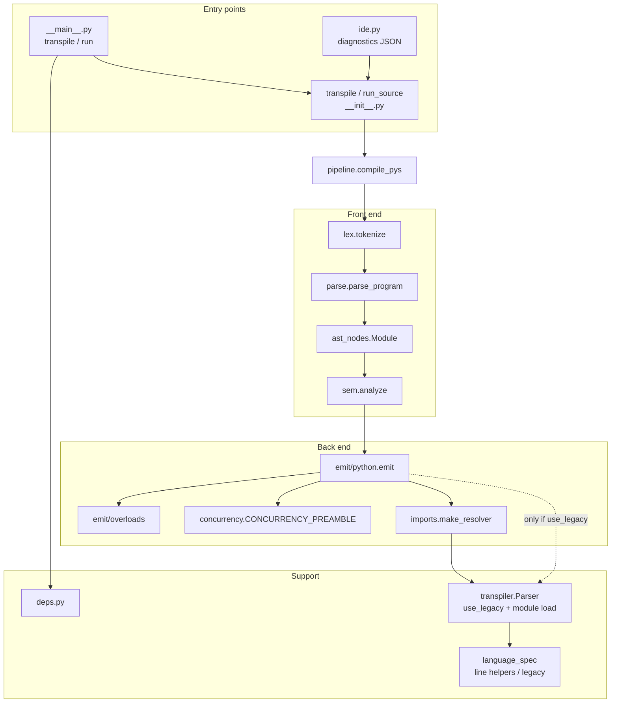
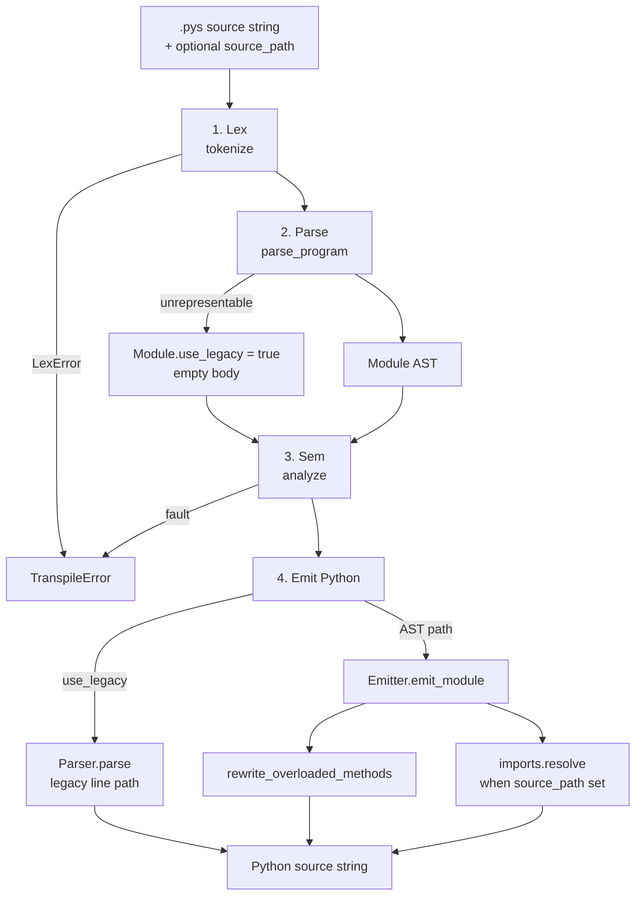
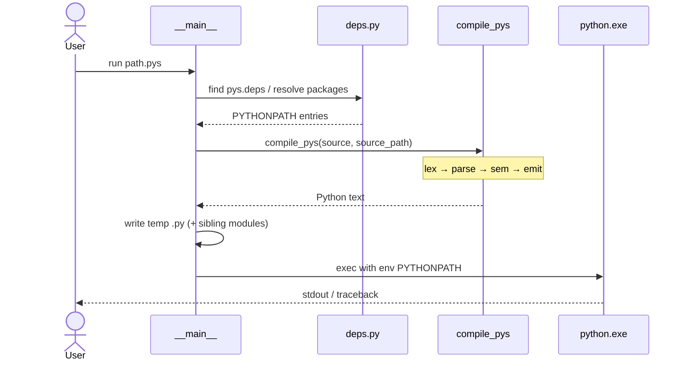
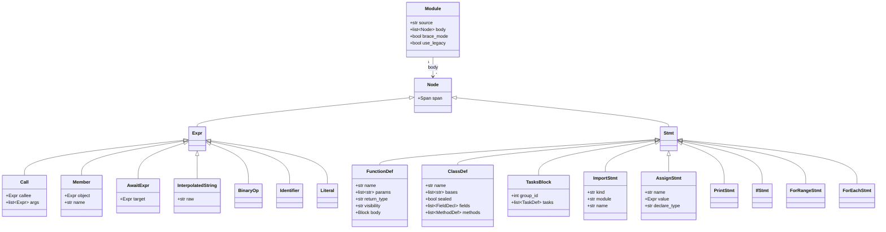
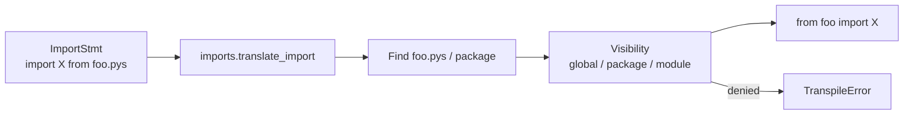
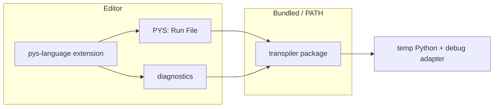

# Architecture

How the PYS toolchain is structured and how a `.pys` file becomes running Python.

Related docs: [LANGUAGE.md](LANGUAGE.md) · [CONCURRENCY.md](CONCURRENCY.md) · [pipeline-migration.md](pipeline-migration.md)

---

## Big picture

Students edit `.pys`. Run/transpile goes through the CLI (or the extension wrapping it). Dependencies are resolved from `pys.deps` into a shared cache; generated Python then runs with that `PYTHONPATH`.

---

## Component architecture

| Module | Role |
| --- | --- |
| `pipeline.py` | Orchestrates **lex → parse → sem → emit** |
| `lex.py` | Tokens with line/column spans |
| `parse.py` | Brace (and limited indent) recursive-descent → AST |
| `ast_nodes.py` | Target-neutral statements / expressions |
| `sem.py` | Semantic checks on the AST (types, access, tasks, arrays, …) |
| `emit/python.py` | Python text from AST |
| `emit/overloads.py` | Post-pass arity dispatch for overloaded methods |
| `concurrency.py` | Shared tasks/await/shared preamble |
| `imports.py` | Facade for `.pys` import resolution / visibility |
| `deps.py` | `pys.deps` → `~/.pys/repository` |
| `transpiler.py` | Public `transpile` / `run_source`; legacy `Parser` for quarantine paths and loading imported `.pys` metadata |

---

## Compiler pipeline (process)

### Stage details

1. **Lex** — Reject illegal tokens early (e.g. tabs).
2. **Parse** — Prefer brace mode when `{`/`}` are present. Indent-mode (`then` / `func` / `repeat`) only when there are no braces. On hard parse failure, set `use_legacy` so emit can fall back for rare unparsed forms.
3. **Sem** — Owns most language rules on the AST: `let`, bindings, const/fix, loop counters, typed interpolation, member access, sealed/interfaces, shared capture (Policy B), arrays, class modifiers, await placement/cycles, import-name access when `source_path` is set.
4. **Emit** — Walk AST to Python; inject concurrency preamble and ABC/array imports as needed; resolve `.pys` imports; rewrite method overloads. Legacy `Parser.parse()` runs **only** when `use_legacy` is true.

---

## Run vs transpile (sequence)

`transpile` stops after `compile_pys` and writes the requested `.py` file (no execute).

---

## AST shape (UML)

High-level view of the module tree the parser produces and sem/emit consume:

---

## Import resolution

When `source_path` is set, emit and sem share the imports facade:

Loading sibling `.pys` metadata still uses the legacy module loader under that facade. Call sites in emit/sem do not construct `Parser` directly except through `imports` / `_legacy_emit`.

---

## Extension ↔ transpiler

The extension packages a copy of the transpiler (`npm run prepare`). Diagnostics and Run share the same front-end rules as `compile_pys` where possible; PYS source-level DAP stepping is deferred ([pipeline-migration.md](pipeline-migration.md) C2).

---

## Extending the pipeline

| Goal | Touch |
| --- | --- |
| New syntax | `lex` → `parse` → `ast_nodes` → `sem` (if checked) → `emit/python` · update `docs/language.ebnf` |
| New semantic rule | Prefer `sem.py` + tests under `tests/test_sem.py` |
| New backend | Add `emit/<target>.py` and a `target=` branch in `pipeline.compile_pys` |
| New dependency behavior | `deps.py` + `pys.deps` docs in the README |

Characterization goldens: `tests/golden/` (regen only via `python tests/golden/regen.py`).
