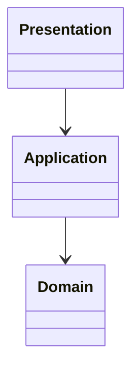
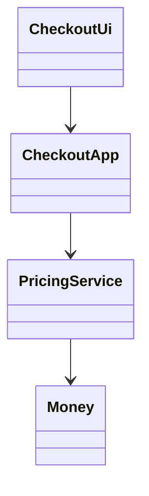

# Layered architecture

**Category:** Architectural  
**Demo:** [layered.pys](layered.pys)  
**Wikipedia:** [Multitier architecture](https://en.wikipedia.org/wiki/Multitier_architecture)

## Intent

Organize code so outer layers (UI) depend on inner ones (application / domain),
not the reverse.

## Explanation

`CheckoutUi` → `CheckoutApp` → `PricingService` / `Money`. Full shops under
[`examples/database/`](../../database/) and [`examples/rest-api/shop/`](../../rest-api/shop/).

## Classic structure (UML)



## This demo



## Real-world use cases

- Classic enterprise n-tier apps.
- Teaching dependency direction before full hexagonal ports.

## Run

```text
python -m transpiler run examples/patterns/architectural/layered.pys
```
