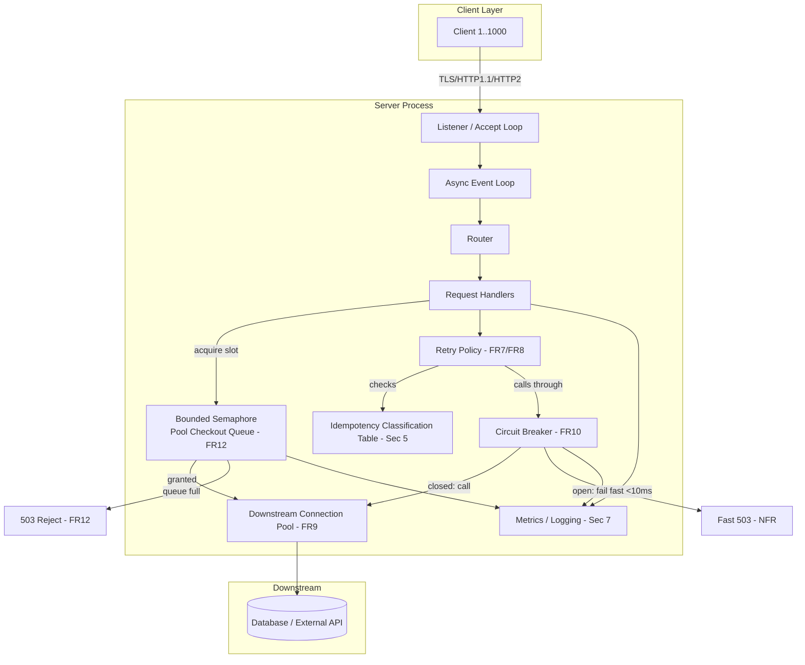
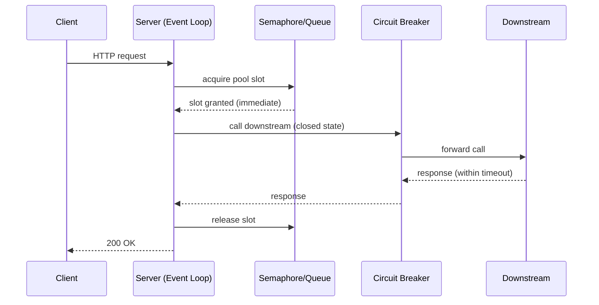
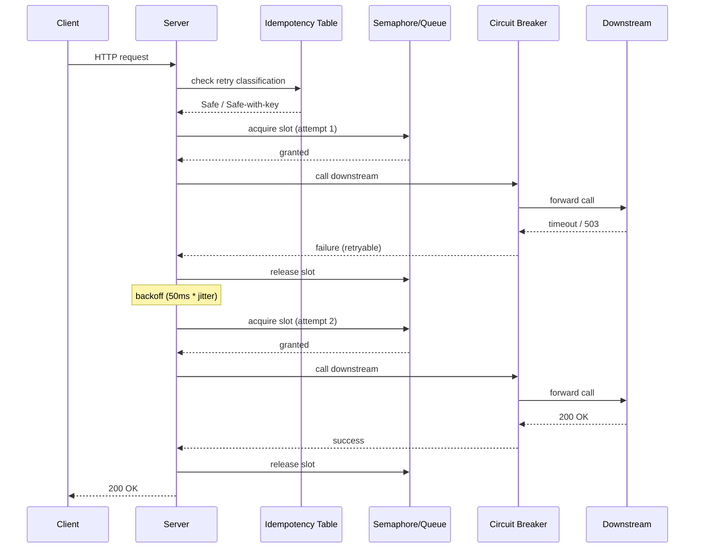
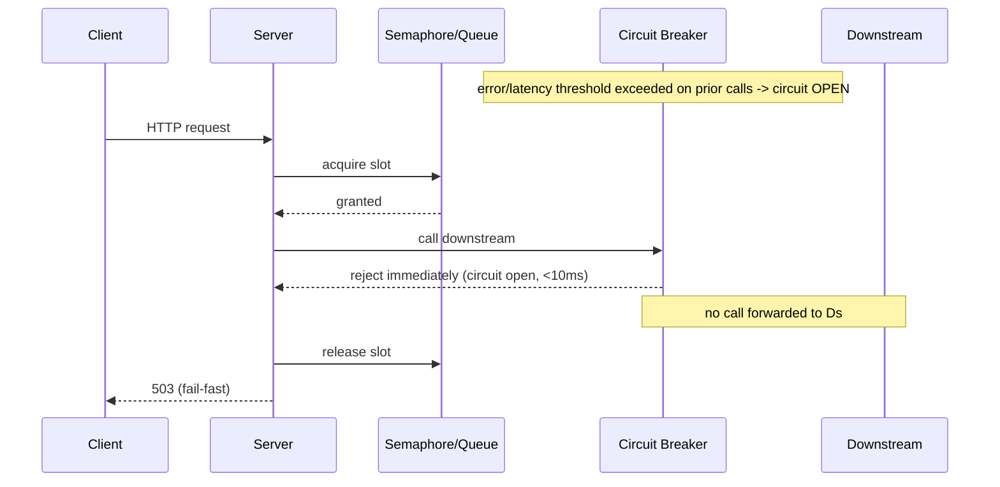
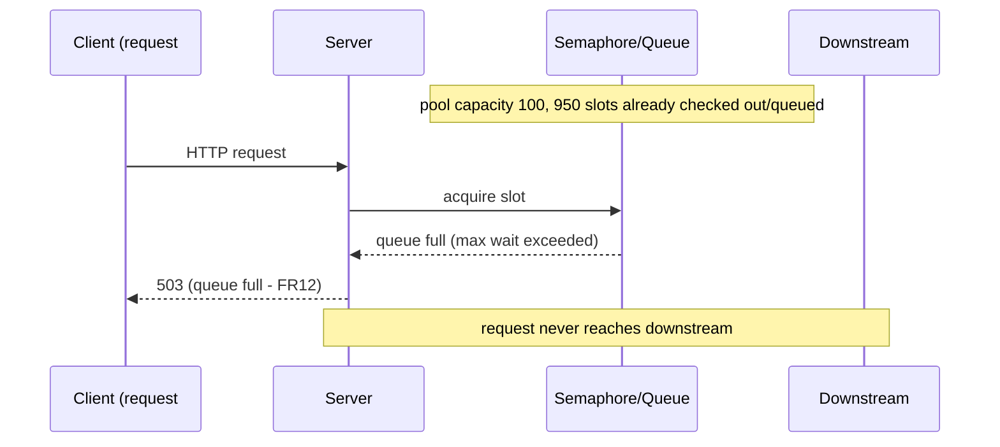

# Specification: Concurrent Web Server (I/O-Bound, Downstream-Bottlenecked)

**Scope**: single-node HTTP server handling ≥1,000 concurrent short-lived, I/O-bound requests, where the primary capacity constraint is a downstream dependency (database and/or external API), not local compute.

---

## 1. Context and Assumptions

| Parameter | Value |
|---|---|
| Concurrency target | ≥1,000 concurrent inbound connections |
| Request duration | Short-lived (target: <500ms end-to-end) |
| Workload type | I/O-bound (proxying, DB queries) |
| Bottleneck location | Downstream dependency, not the server process |
| Deployment | Single node (horizontal scaling explicitly out of scope) |

Horizontal scaling, caching strategy, and downstream dependency's own internal concurrency limits are **out of scope** for this document; they are called out as external constraints the server must defend itself against, not systems this spec designs.

---

## 2. Functional Requirements

| ID | Requirement |
|---|---|
| FR1 | Accept and process ≥1,000 simultaneous client connections without connection refusal or unbounded queuing. |
| FR2 | Support HTTP/1.1 (keep-alive) and HTTP/2 (multiplexed streams). |
| FR3 | Route requests to handlers based on method + path. |
| FR4 | Return correct HTTP status codes (429, 503) when capacity is exceeded, rather than dropping connections silently. |
| FR5 | Support TLS termination (TLS 1.2/1.3). |
| FR6 | Configurable request timeouts (read, write, idle, handler). |
| FR7 | Retries apply only to endpoints explicitly classified idempotent (§5); non-idempotent endpoints fail fast on first downstream error. |
| FR8 | Retry attempts count against the downstream pool checkout (FR-pool below) — a retry is a new pool acquisition, not exempt from bulkhead/queue limits. |
| FR9 | Maintain a downstream connection pool sized independently of inbound connection count. |
| FR10 | Circuit breaker wraps downstream calls: open after configurable error/latency threshold; fail fast rather than queue against a dead dependency. |
| FR11 | Bulkhead isolation between distinct downstream dependencies — exhaustion of one pool must not starve requests unrelated to it. |
| FR12 | Bounded queue for requests waiting on downstream pool checkout; reject (503) beyond threshold. |

---

## 3. Non-Functional Requirements

| Property | Target |
|---|---|
| Concurrency | ≥1,000 concurrent connections, single node |
| Fail-fast latency | Circuit-open rejection returns in <10ms (no wait on downstream timeout) |
| Timeout hierarchy | downstream call timeout < handler timeout < client-facing request timeout (strictly increasing) |
| Memory | Bounded per-connection overhead (<50KB/idle connection) |
| Queue wait | Max wait for pool checkout is configurable; exceeded → 503, not indefinite wait |
| Availability | A slow/failing downstream degrades response *rate*, not process stability |

---

## 4. Architecture Requirements

- **Concurrency model**: event-loop (async I/O) or lightweight-thread-per-connection. OS-thread-per-connection is explicitly excluded (context-switch/stack overhead at 1k scale).
- **Non-blocking I/O** for all network operations; any unavoidable blocking call isolated to a bounded worker pool.
- **Downstream pool decoupled from inbound concurrency** — inbound connections may vastly outnumber downstream pool slots; this is expected, not a defect, and must be governed explicitly (FR12), not left to implicit queuing.
- **OS-level tuning**: file descriptor limits (`ulimit -n`) and kernel socket backlog (`somaxconn`) raised to accommodate target concurrency.

---

## 5. Idempotency Classification (Prerequisite Deliverable)

Must be completed and reviewed **before** FR7/FR8 (retry) are enabled. Unclassified endpoints default to no retry.

| Column | Values |
|---|---|
| Endpoint | `METHOD /path` |
| Idempotent by method semantics? | Yes/No (`GET/PUT/DELETE/HEAD/OPTIONS` → presumptive yes; `POST/PATCH` → presumptive no) |
| Idempotent in practice? | Yes/No — verified against actual handler side effects, not method alone |
| Idempotency mechanism | None / Natural (PK upsert) / Client-supplied key / N/A |
| Retry classification | Safe / Unsafe / Safe-with-key |
| Downstream side effects | DB write, email, payment charge, etc. — irreversible external effects default to Unsafe |

**Process requirements:**

| ID | Requirement |
|---|---|
| PR1 | No endpoint enrolled in retry policy without a completed classification row. |
| PR2 | Classification reviewed by someone with handler-level knowledge, not inferred from HTTP method alone. |
| PR3 | `Safe-with-key` endpoints require specified idempotency-key propagation and server-side dedup window before retry is enabled. |
| PR4 | CI/code-review gate flags new or modified endpoints lacking a classification entry. |
| PR5 | Classification table versioned in the same repo/PR as the endpoint changes it covers. |

---

## 6. Retry Policy

| Parameter | Value | Rationale |
|---|---|---|
| Max attempts | 3 (1 initial + 2 retries) | Bounds worst-case latency; avoids compounding load on a degraded downstream |
| Backoff | Exponential with jitter (base 50ms, factor 2, ±20% jitter) | Prevents retry storms against a recovering downstream |
| Retry budget | ≤10% of request volume in a rolling window | Stops retries amplifying load during widespread degradation |
| Retryable conditions | Connection errors, timeouts, 502/503/504 | 4xx and non-idempotent 5xx are never retried |
| Circuit interaction | Retries never bypass an open circuit | Retries must not be the mechanism keeping a failing downstream saturated |
| Timeout interaction | Total retry budget (attempts × backoff) fits within client-facing timeout | Retry logic must not silently exceed the promised response time |

---

## 7. Observability Requirements

- Active connections, requests/sec, latency percentiles (p50/p95/p99), error rate, queue depth.
- Downstream pool utilization: busy/idle/waiting count — this saturates *before* client-facing latency shows it.
- Circuit breaker state transitions logged.
- Distinguish, in metrics and logs: server-side rejection (queue full) vs. downstream-side failure (circuit open) — same client-facing 503, different root cause.
- Structured logging with request correlation IDs, propagated through retries.

---

## 8. Testing / Verification

| Test | Purpose |
|---|---|
| Sustained concurrency load (≥10 min, persistent connections via `wrk`/`k6`/`vegeta`) | Detect FD exhaustion, memory leaks |
| Overload test (110–150% of target concurrency) | Verify graceful 503 shedding (FR4), not crash |
| Fault-injection test (slow/failing downstream) | Verify circuit breaker + bulkhead behavior — happy-path testing alone does not validate this spec |
| Retry-storm test | Verify retry budget caps amplification during downstream degradation |

---

## 9. Component Architecture

---

## 10. Sequence Diagrams

### 10.1 Normal Request (downstream healthy, pool available)

### 10.2 Retry Flow (idempotent endpoint, transient downstream failure)

### 10.3 Circuit Open / Fail-Fast Flow (downstream degraded)

### 10.4 Queue-Full Flow (pool exhausted, inbound concurrency exceeds downstream capacity)

---

## 11. Sequencing / Rollout Order

1. Idempotency classification table completed and reviewed (§5).
2. Retry-eligible endpoints marked (FR7) against the table.
3. Pool/bulkhead accounting for retries (FR8) and retry parameters (§6) implemented.
4. Fault-injection load test (§8) run against classified endpoints only.

Default posture until step 1 completes: **no retries anywhere, fail-fast on first downstream error.**
