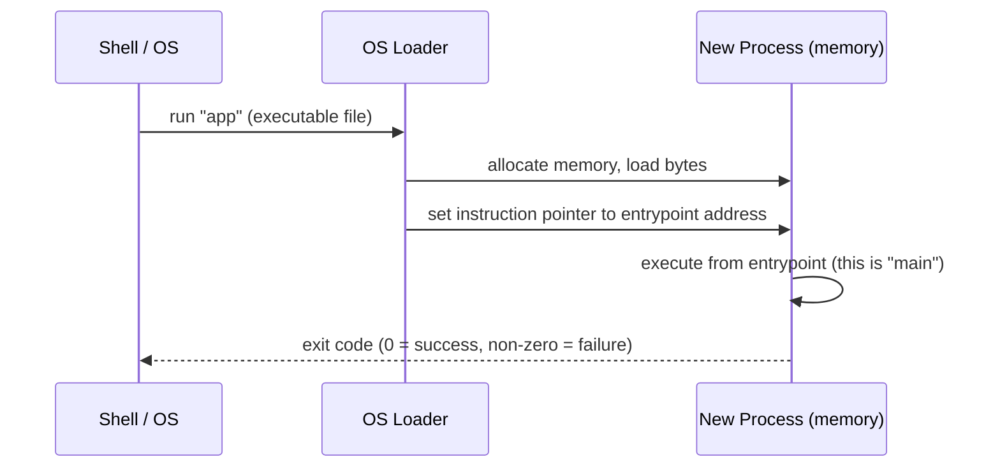
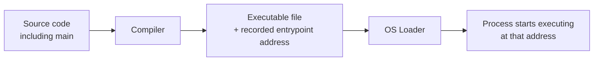
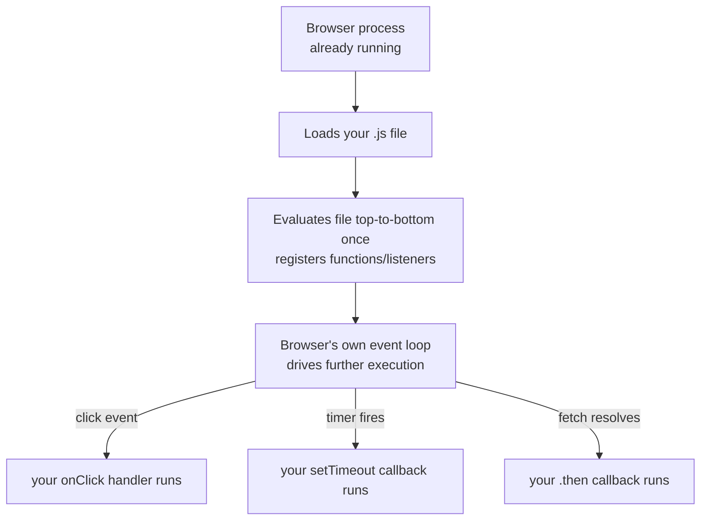

# Why does a program need a `main`?

> This chapter answers a question almost every student asks eventually,
> usually while comparing PYS to a language they already know: "why do I
> have to write `main`? My other language didn't need one." The short
> answer is that it did — it was just provided by something other than
> you. This chapter explains what "running a program" actually means at
> the operating-system level, so that answer stops sounding like an
> arbitrary rule and starts sounding like the only sensible design.

## 1. What "running a program" means to the operating system

A program on disk is just a file — bytes sitting on a storage device,
doing nothing. "Running" it means the operating system:

1. **Loads** those bytes into a fresh block of memory, creating a *process*.
2. Sets up that process's initial state: a stack, a heap, access to
   command-line arguments and environment variables.
3. Points the CPU's instruction pointer at **one specific address** and
   tells it to start executing instructions from there.
4. Keeps running until the process either finishes on its own or is
   terminated — and reports an **exit code** back to whoever started it
   (the shell, another program, an orchestration system).

Step 3 is the crux of this whole chapter. The operating system does not
"figure out" where a program's logic begins by reading through the file
looking for something interesting. It needs one unambiguous starting
address, decided in advance, every time. `main` is not a PYS convention —
it's PYS's name for the thing every OS-loaded program needs to have
*something* be, under *some* name.



## 2. Where the entrypoint's *name* comes from: compiled languages

In a compiled language (C, C#, Java, Rust, PYS), the compiler's job
includes recording, inside the resulting executable's file format, the
memory address the OS loader should jump to. To know *which* address that
is, the compiler needs a convention: a specific, recognizable function the
programmer is required to write, so the compiler can find it and record
its address. That function is `main` (or, in managed runtimes like the
JVM/.NET, a designated method the runtime's own loader looks for instead
of the raw OS loader — same idea, one layer up).



This is why "no `main`" was never actually true in the student's earlier
experience — it was true of JavaScript specifically, for a different
reason covered in §4, not a general property of "modern" or "simpler"
languages. Dart, which the student moved to via Flutter, requires an
explicit `main()` exactly like PYS:

```dart
void main() {
  runApp(MyApp());
}
```

The confusion likely stemmed from moving JavaScript → Dart, not from
Dart or PYS doing something unusual — Dart is squarely in the same
tradition as C, C#, Java, and PYS here.

## 3. Compiler vs. interpreter — does this distinction still apply?

Yes, but it changes *when* the entrypoint decision is made, not *whether*
one exists.

| | Compiled | Interpreted |
|---|---|---|
| Entrypoint recorded | At compile time, baked into the executable's file format (e.g. the ELF header on Linux, the PE header on Windows) | At run time, by convention: the interpreter starts executing the file it was told to run, from its first line |
| Who finds the entrypoint | The OS loader, by reading the compiled file's metadata | The interpreter itself, by simply starting at the top of the given file |
| Example | C, C#, Java (compiled to bytecode, then the JVM acts as loader for a class's `main` method), PYS (transpiles to Python, which is then interpreted) | Python (run directly), Ruby, un-bundled JavaScript in Node.js |

PYS sits in an interesting middle position worth naming explicitly in this
chapter: PYS itself is a compiled-to-another-language design (it
transpiles to Python), and Python is then interpreted. The `main`
requirement in PYS is a **PYS-language-level design decision**, independent
of Python's own execution model — PYS could have chosen not to require one
and instead let its emitter treat the whole file as sequential script
code, the way Python itself does. It deliberately did not, precisely so
that the entrypoint concept could be taught explicitly and transfer
directly to C# and Java, PYS's target languages, both of which are
compiled and both of which require an explicit entrypoint. See
§5 for how PYS formalizes this (`pys.toml` `main` field / direct
invocation).

## 4. Why JavaScript in the browser genuinely has no `main`

This is the part of the student's mental model that was actually correct
for the language he was comparing against — it just didn't generalize.

A `.js` file running in a browser is not loaded by the operating system as
a standalone process. It is loaded by the browser, which is itself
already a running process. The browser provides a **host environment**:
a global object (`window`), a DOM already sitting in memory, and an event
loop that was already running before your script arrived. Your script
doesn't need to declare where execution starts, because the browser
doesn't hand control to your file the way an OS hands control to a
freshly loaded process — it *evaluates your file top to bottom once*
(registering any functions and event listeners you define), and from then
on, execution happens as a reaction to events the browser itself
generates: a click, a timer, a network response.



There is no single "start here and run to completion" point because the
browser's execution model isn't "run a program to completion" — it's
"stay alive and react to events for as long as the tab is open." Node.js,
notably, is the same JavaScript *language* but a different *host*: a
Node.js script also has no `main` function, but for the same underlying
reason — the Node.js runtime itself is the host process, and it evaluates
your file top-to-bottom as its own form of "entrypoint," conceptually
equivalent to what PYS calls `main`, just without requiring you to name
or declare it.

**The generalizable lesson**: "does this language need an explicit
`main`?" is really the wrong question. The right question is "is this
code being loaded directly by the OS as a new process, or is it being
loaded into an already-running host that provides its own execution
model?" Compiled, OS-loaded programs need a declared entrypoint because
nothing else exists yet for the OS to hand control to. Scripts loaded into
an already-running host (a browser, a game engine, a plugin system) often
don't, because the host already has its own control flow and your code is
just contributing to it.

## 5. Back to PYS

PYS requires an explicit entrypoint because PYS programs are meant to
become standalone OS processes (via the Python interpreter, itself
launched as a process) or, in principle, other compiled targets later —
exactly the "loaded directly by the OS" case from §4, not the "loaded into
an already-running host" case. The entrypoint is resolved either via an
explicit `main` field in `pys.toml`, or by direct invocation of a file —
see the PYS language specification's entrypoint resolution section for the
full formal rule, and for how this interacts with `propagate` and `panic`
at the top level of the entrypoint file specifically.

## 6. Summary table for quick reference

| Language / environment | Explicit entrypoint required? | Why |
|---|---|---|
| C, C#, Java | Yes (`main`) | OS or managed-runtime loader needs a fixed starting point |
| Rust | Yes (`fn main()`) | Same as above |
| Dart (incl. Flutter apps) | Yes (`void main()`) | Same as above — Flutter apps are still OS-loaded processes under the hood |
| PYS | Yes (`main`, resolved via `pys.toml` or direct invocation) | Deliberately mirrors C#/Java for teaching transfer, even though the emitted Python could technically run without one |
| Python (script run directly) | No formal requirement, but `if __name__ == "__main__":` is the idiomatic stand-in | The interpreter just starts at the top of the file; the idiom exists specifically to guard against import-time execution — see the PYS spec's discussion of this exact pitfall |
| JavaScript in a browser | No | Host (the browser) provides its own event-driven control flow; your file is evaluated once to register into it, not executed as a standalone process |
| JavaScript in Node.js | No | Same reasoning as the browser case — Node.js is the host process; your file's top level is the closest analogue to an entrypoint, but it isn't a declared one |

## Exercise

> Ask yourself, for a language or framework you've used before: was your
> code loaded directly by the operating system, or was it loaded into an
> already-running host (a browser, a game engine, a spreadsheet macro
> environment, a plugin API)? Write one sentence justifying your answer.
> If you're not sure, that uncertainty is itself useful information —
> it usually means you've never had to think about where your code's
> control flow actually started, which is exactly the gap this chapter
> is meant to close.
