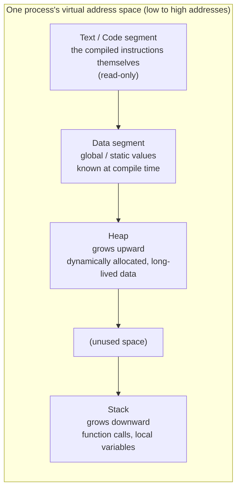
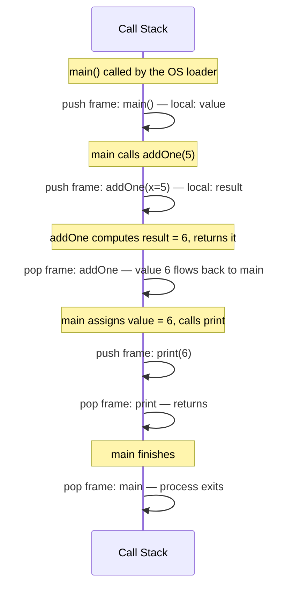
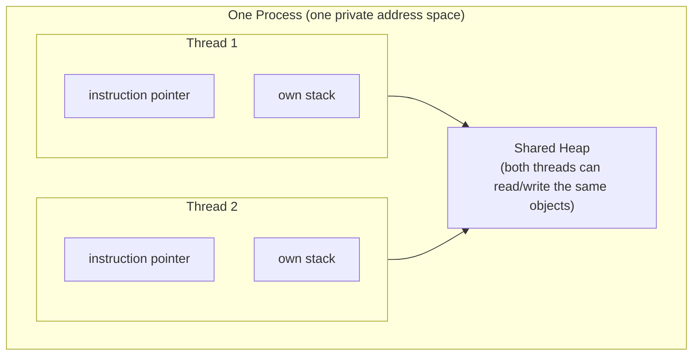

# Processes, threads, and memory: what's actually happening when your code runs

> The previous chapter established that the OS loads a program into
> memory and points the instruction pointer at `main`. This chapter opens
> that up: what does "memory" mean here, what shape does a running
> program actually have inside it, and what's the difference between a
> process and a thread? These are ideas every language you'll use after
> PYS — C#, Java, and everything else — assumes you already have. PYS
> itself hides most of this behind higher-level constructs (`class`,
> `entity`, `tasks`), which is precisely why it's worth seeing what's
> underneath them at least once.

## 1. Memory as an address space

Your computer's RAM is, physically, one enormous array of bytes, each
with a numeric address. When the OS loads a program into a process
(Chapter: *Why does a program need a `main`?*), it doesn't hand that
process the *real*, physical addresses of RAM. It hands it a **virtual
address space**: a private range of addresses, starting at 0 and going up,
that looks to the process like it has the whole machine's memory to
itself. The OS (with hardware help) transparently maps these virtual
addresses to wherever the real bytes actually live in physical RAM. Two
processes can both believe they own address `0x1000`, and never collide,
because each has its own private mapping.

This matters for one practical reason you'll rely on constantly without
thinking about it: **processes cannot accidentally read or corrupt each
other's memory.** A bug in one program cannot reach into another running
program's variables. This isolation is the whole reason a crashing
application doesn't take the rest of your operating system down with it.

## 2. How a single process's memory is laid out

Within its own private address space, a running process's memory is
divided into distinct regions, each with a different purpose and
different rules about how it's used:



- **Text/code segment**: the compiled instructions — the actual machine
  code the instruction pointer steps through. This region is typically
  marked read-only; a program is not allowed to modify its own
  instructions while running.
- **Data segment**: values that exist for the entire lifetime of the
  program and whose size is known before the program even starts —
  global constants, for instance.
- **Heap**: memory requested *while the program is running*, for data
  whose size or lifetime isn't known in advance. Covered in §5.
- **Stack**: memory used for function calls — arguments, local variables,
  and the information needed to return to the right place when a function
  finishes. Covered in §4.

## 3. The instruction pointer, revisited

The previous chapter introduced the instruction pointer as "the address
the CPU is told to start executing from." Now that you've seen the
memory layout, this can be stated more precisely: the instruction pointer
(also called the *program counter*) is a single number, held by the CPU,
pointing somewhere into the **text segment**. After executing one
instruction, the CPU advances the instruction pointer to the next one —
unless that instruction was a jump, a function call, or a return, in
which case the instruction pointer is set to wherever that operation
points instead. A running program, at the lowest level, is nothing more
than this pointer moving through the text segment, one instruction at a
time, occasionally jumping.

## 4. The stack: how function calls actually work

Every time a function is called, the running program needs somewhere to
put: the arguments passed in, any local variables the function declares,
and — critically — the address to jump back to once the function
finishes. This bundle of information is called a **stack frame**, and
it's pushed onto the stack when the function is called, and popped off
when the function returns.

```pys
function int addOne(int x) {
    int result = x + 1
    return result
}

function void main() {
    int value = addOne(5)
    print(value)
}
```



Three properties of the stack follow directly from how it's used:

1. **Last in, first out.** The most recently called function is always
   the one that finishes and returns first — you can't return from
   `main` while `addOne` is still mid-execution, because `addOne`'s frame
   is on top of `main`'s.
2. **Fixed, predictable lifetime.** A local variable's memory (`result`,
   `value` above) is only valid for as long as its function's frame
   exists. The instant `addOne` returns, its frame — and `result` along
   with it — is gone. This is exactly why you cannot return a pointer or
   reference to a local variable in languages that expose this directly
   (a classic C bug): the stack memory it lived in has already been
   reclaimed for the next call.
3. **Fast, but limited in size.** Pushing and popping a stack frame is
   about as cheap as an operation gets — just moving a pointer. But the
   stack has a fixed maximum size decided when the process starts; a
   function that calls itself without ever stopping (uncontrolled
   recursion) eventually exhausts it — a **stack overflow**, the actual
   mechanical event that famous error message is named after.

## 5. The heap: memory that outlives a single function call

Not everything fits the stack's rules. Sometimes you need data whose size
isn't known until the program is running (a list that grows), or whose
lifetime needs to extend beyond the function that created it (an object
handed off to be used elsewhere, long after the creating function has
returned). This is what the **heap** is for: memory explicitly requested
at run time, which stays allocated until something explicitly gives it
back (in languages with manual memory management) or until nothing in the
program can reach it anymore (in *garbage-collected* languages — see
§6).

The heap trades away the stack's speed and automatic cleanup for
flexibility: allocating heap memory is a comparatively expensive
operation (the runtime has to find a suitably sized free block), and
nothing automatically reclaims it just because the function that
requested it has returned.

| | Stack | Heap |
|---|---|---|
| Allocation speed | Extremely fast (pointer move) | Slower (must find/track free space) |
| Lifetime | Tied to the function call that created it | Independent — lives until reclaimed |
| Size | Fixed maximum, set at process start | Limited only by available memory |
| Typical contents | Local variables, function arguments, return addresses | Objects/instances that need to outlive their creating function, or whose size isn't known in advance |
| Failure mode | Stack overflow (uncontrolled recursion) | Out of memory (leaked or excessive allocation) |

## 6. Who cleans up the heap? Manual vs. garbage-collected

Two broad strategies exist for reclaiming heap memory once it's no longer
needed:

- **Manual management** (C, and C++ without smart pointers): the
  programmer explicitly requests memory and explicitly frees it. Forget
  to free it: a **memory leak**. Free it, then use it again: a
  **use-after-free** bug — one of the most severe classes of security
  vulnerability in systems software.
- **Garbage collection** (Java, C#, Python — and by extension, PYS, since
  it transpiles to Python): the runtime periodically scans the heap,
  finds objects nothing in the program can reach anymore, and reclaims
  their memory automatically. This eliminates the two bug classes above,
  at the cost of some runtime overhead and less predictable timing of
  when memory is actually reclaimed.

**A note specific to PYS**: because PYS's reference emitter targets
Python, every `class`, `entity`, and `data` instance you create in PYS
ends up as a heap-allocated, garbage-collected Python object at run
time — PYS does not currently specify or expose a stack-allocated value
type the way C#'s `struct` does. This is worth knowing explicitly, because
C# draws a sharp, visible line between `struct` (stack-allocated by
default, copied by value) and `class` (heap-allocated, referenced) — a
distinction you will need to actively learn when you move to C#, since
nothing in PYS's own `struct`/`data`/`entity`/`class` family currently
maps onto that stack-vs-heap difference the way C#'s does. Keep this in
mind for the *From PYS to C#/Java* chapter: PYS's `struct` is about
*equality and mutability semantics*, not about *where the data physically
lives* — in C#, for structs, it's about both at once.

## 7. Process vs. thread

Everything above described one thread of execution: one instruction
pointer, moving through one stack. A **process**, as established in the
previous chapter, is an OS-loaded program with its own private address
space. A **thread** is a separate flow of execution *within* that same
process — its own instruction pointer and its own stack, but sharing the
same heap, the same data segment, and the same text segment as every
other thread in that process.



This single fact — **threads share the heap, but each has its own
stack** — is the root of essentially everything concurrency-related you
will encounter, in any language:

- Local variables (stack) are automatically safe across threads, because
  each thread has its own stack; there's nothing to share.
- Anything on the heap (which, per §6, is *everything* in PYS today) is
  potentially visible to every thread — which is exactly the problem the
  PYS language specification's `shared` and `atomic` qualifiers exist to
  make visible and, for `atomic`, safe. A `shared` variable is a plain
  admission that "yes, this heap-allocated data is genuinely reachable
  from more than one thread's code, on purpose."
- The DAG requirement on `await` dependencies in PYS's `tasks` block
  exists to keep this shared-heap access predictable, without requiring
  you to reason about raw threads directly — but the underlying reason
  it matters at all is the shared heap described in this section.

| | Process | Thread |
|---|---|---|
| Own address space | Yes — fully isolated | No — shares its process's address space |
| Own stack | Yes (inherent to being a separate process) | Yes — this is what makes it a distinct thread |
| Shares heap with siblings | No — a different process cannot see another process's heap at all | Yes — this is the defining property of a thread |
| Crash isolation | A crashing process does not take down other processes | A crashing thread can corrupt shared state or crash the whole process |
| Creation cost | Relatively expensive (new address space, new everything) | Cheaper — reuses the process's existing memory setup |

## 8. Bringing it back to PYS

- `main`, and the instruction pointer stepping through it: the previous
  chapter, now grounded in what "memory" and "instruction pointer"
  concretely mean.
- Every local `var`/`fix` you declare inside a PYS function lives on the
  stack, exactly as in §4 — and is gone the instant that function
  returns, which is *why* you can't return a reference to it (the same
  underlying reason this is unsafe in any language, whether or not that
  language lets you attempt it).
- Every `class`/`entity`/`data` instance you construct lives on the heap
  (§5, §6) — this is *why* two variables can refer to "the same"
  `Customer` instance and both see a change one of them makes, while two
  `int` variables never do: it's the stack-vs-heap distinction from this
  chapter, not something special about `entity` specifically.
- `tasks`/`task`/`await`, and the necessity of `shared`/`atomic`: all of
  it exists because of §7 — multiple threads sharing one heap.

None of this changes how you write PYS day to day. It changes what you
understand is happening underneath it — which is exactly the layer C#
and Java will expect you to already have some intuition for.

## Exercise

> Without running anything, predict: if `addOne` in the §4 example
> called itself recursively with no stopping condition, which memory
> region would eventually be exhausted, and what would the resulting
> failure be called? Then predict the opposite failure mode: if a program
> kept creating new `entity` instances in a loop, forgot every reference
> to each one immediately after creating it, and this ran forever on a
> language *without* garbage collection — which region would be
> exhausted, and what would that failure be called? Check both answers
> against §4–§6 above.
